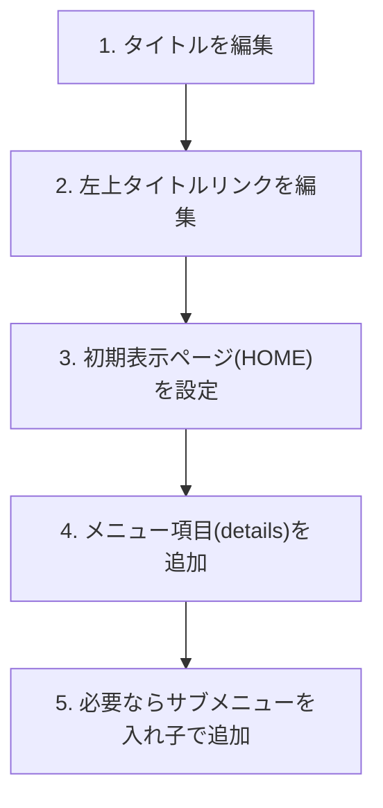
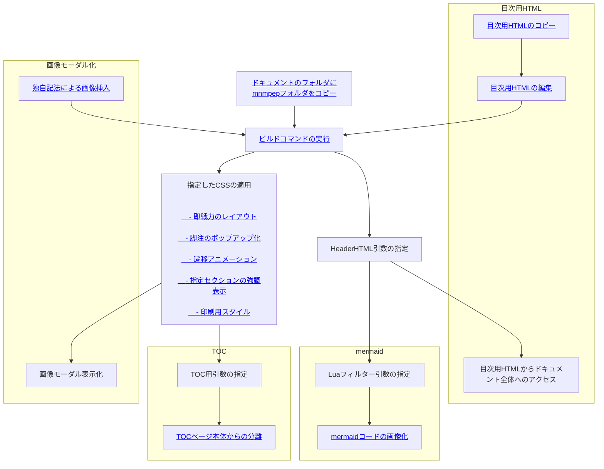

## Pandoc を “実用的なドキュメント生成ツール” に変える拡張パック

mnmpep は、[Pandoc](https://pandoc.org/) の Markdown→HTML 変換を大幅に強化するユーティリティパックです。  
導入するだけで、Pandoc の素っ気ない HTML を、**読みやすく・使いやすく・実用的なドキュメント**へと変換できます。

テーマやプラグインではなく、CSS・ヘッダーHTML・Luaフィルターを組み合わせて  
**Pandoc のビルド結果に機能性とデザインを直接付与する**のが特徴です。

複数のMarkdownファイルをmnmpepを利用して仕上げたHTMLドキュメント例は、[こちら](https://minamo-laboratory.com/mnmpep-readme)をご覧ください。  

## mnmpepの概要

Pandocは、markdownドキュメントをHTMLに効率よく変換する強力な手段です。  
ですが、変換されたHTMLドキュメントは、決して読みやすく、利用しやすい理想的なものではありません。  

mnmpep は、Pandoc の初期状態を調整することなく、  
**即座に実用的な HTML ドキュメントを生成できるようにする拡張パック**です。  

mnmpepが提供するフォルダに含まれる CSS・ヘッダー HTML・Lua フィルターをビルド時に指定し、index.html の配置・編集など、いくつかの簡単な手順をこなすことで、Pandoc の出力 HTML に下記のような効果をもたらします。  

1. 即座にドキュメントとして利用できる、整ったレイアウトの適用
    - 標準の、無機質でかつ見づらいレイアウトから即座にグレードアップできます
    - ダークモードに対応
    - css変数で色を定義しているため、色調の調整は容易です
2. 各ページを切り替え、SPA的にドキュメント全体に対してアクセス可能となる目次HTMLの配備
    - 各Markdown内にこまめにリンクを書く必要がなく、複数ファイルに渡るドキュメントを「一冊」としてまとめて扱えます
    - ドキュメント著者は、作成時に長大な1ファイル内の往復を強いられることがなくなります
    - 読者は、内容ごとに適切なページを探すことが出来るようになります
3. Markdownでの特殊記法を用いた、ページ内画像クリック時のモーダル表示機能の実現
    - ドキュメント著者は、ページ幅に合わせた画像サイズの調整の手間が必要なくなります
    - 読者は、画像の細部を確認することが容易になります
4. 脚注クリック時の挙動を、ドキュメント最下部脚注への強制移動から、画面下部からのポップアップ表示に変更
    - 脚注から戻る際に元の位置に迷う事も、時間をかけることもなくなります
    - 本文を見ながら脚注を見ることが出来るようになります
5. TOCをページ本体から分離し、ページ横からアクセス可能に
    - 1200px以上の表示環境下では、左側余白部分にTOCを常時表示
    - 1200px未満の表示環境下では、TOCをスライドメニュー化
6. mermaidコードブロックを、自動的にSVG画像に変換して本文中に埋め込み
7. ページ内やページ間遷移時のアニメーションと、ページセクション指定遷移時の指定セクション強調表示
    - 参照リンクから遷移したはいいが、参照箇所が分かりづらいという事がありません
8. 印刷用スタイルも調整済み

また、Markdownファイルをwordファイルにビルドする場合、luaフィルターを通じて、mermaidコードブロック内容を図としてpng画像化して埋め込むことも可能です。  

Pandocとmnmpepの組み合わせは、あなたのMarkdownテキストを、**現代HTMLの表現力を詰め込んだブラウザ用ドキュメントに高速で仕上げます。**


## mnmpepの導入方法

### 動作環境

pandocをインストール済みのPCでご利用いただけます。  
Windows11にて動作確認をしておりますが、macOSおよびLinux、また別バージョンのWindowsであっても、Pandocが利用可能な端末であれば利用できるはずです。  

#### オプション要件

wordファイルにビルド時のmermaid画像埋め込みを利用される場合は、[mmdc](https://github.com/mermaid-js/mermaid-cli#readme)をグローバルコマンドとして利用可能にする必要があります。

### mnmpepの入手

[こちら](https://github.com/minamo-tsukino/mnmpep/releases/)からダウンロードしたzipを展開します。  
展開したフォルダをお使いの端末内に保存しておけば、新たに別のドキュメントを作成する際にコピーして使い回せます。  

### mnmpepを利用したいドキュメントフォルダへのコピー

展開したフォルダ内にある`mnmpep-package`フォルダの内容全てを、HTMLもしくはwordドキュメントにビルドしたいmarkdownドキュメントを作成する、あるいは保存済みのフォルダにコピーしてください。  
なお、目次用HTMLが必要ない場合は、フォルダ内の`index.html`はコピー不要です。


## mnmpepの利用方法

mnmpepは、下記の内容で構成されています。  

```
/mnmpep-main
├─/mnmpep-package
│ ├─/mnmpep
│ │ ├─close.svg
│ │ ├─header.html
│ │ ├─mermaid.lua
│ │ ├─mermaid.min.js
│ │ └─style.css
│ │
│ └─index.html
│ 
├─/img
├─LICENSE
└─readme.md
```

ビルド時のフォルダ及びビルド後の出力フォルダに必要となるのは、`mnmpep-pacage`フォルダ内に存在する`mnmpep`フォルダと、`index.html`です。  

#### mnmpepフォルダ

通常の利用をされる場合は、以下の事項に注意して運用すれば問題はありません。  

- ビルド対象のmarkdownドキュメントが存在するフォルダと、出力するHTMLファイルが同一の場合、またはWordファイルを出力する場合は、ビルドを実行するフォルダにmnmpepフォルダをそのままコピーして貼り付ける
- ビルド対象のmarkdownドキュメントが存在するフォルダと、出力するHTMLファイルが異なる場合、ビルドを実行するフォルダと出力先フォルダ双方にmnmpepフォルダをそのままコピーして貼り付ける

以下は、mnmpepフォルダのより高度な扱いに興味のある方への補足情報です。  

pandocコマンドでHTMLおよびwordファイルをビルドする時点で必要となるのは、下記のファイルです。  

- `header.html`
- `mermaid.lua`
- `style.css`

これらがビルドする対象となるmarkdownファイルの存在するフォルダに配置されていることで、[下記のビルドコマンド例](#htmlへのビルドコマンド例)が有効になります。  

ビルドしたHTMLファイルが必要とするのは、下記のファイルです。  

- `close.svg`
- `mermaid.min.js`
- `style.css`

これらはHTMLファイルから読み出されるため、ビルドしたHTMLファイルの存在するフォルダ内に、これらのファイルを保存したmnmpepフォルダが必要となります。  

### 文章中に埋め込む画像をモーダル表示化したい場合

通常のmarkdown記法による画像の指定ではなく、下記のテンプレートに従った特殊な記法でmarkdownファイル内に記述することで、ビルド後のHTMLファイルで画像をクリックするとモーダル表示がされるようになります。  

```markdown
[[画像に付け加えたいキャプション文]{.fc}](#画像に付与するID){#画像に付与するID}[](#!){.clsbtn}
```

例えば、ビルドしたHTMLファイルに対して、`./img/sample-photo.jpg`という相対パスに存在する画像に、"説明用の写真です"というキャプションを付けたモーダル表示をしたい場合、

```markdown
[[説明用の写真です]{.fc}](#photo01){#photo01}[](#!){.clsbtn}
```

という記述を、画像を挿入したい部分に記します。  
上記例の`#photo01`は、HTMLのid属性として利用するため、必ず頭に`#`を付与する必要があります。  
二カ所とも、必ず同じ文字列を記述してください。  
`photo01`の部分は任意の文字列で構いませんが、同じmarkdownファイル内の他の画像と重複しないように命名してください。  

### HTMLへのビルドコマンド例

mnmpepの機能を実装したHTMLドキュメントを作成する際は、以下の例に沿って、ビルドするファイルの存在するフォルダでpandocコマンドを実行してください。  

```sh
pandoc -s --section-divs --toc --toc-depth=4 -c ./mnmpep/style.css -L ./mnmpep/mermaid.lua -H ./mnmpep/header.html './{原稿マークダウンファイル名}.md' -o './{出力HTMLファイル名}.html'
```

ビルドファイルの存在するフォルダ内にmnmpepフォルダが存在しない場合は、コマンド内の相対パスを調整してmnmpepフォルダを読むようにしてください。


### 目次用HTMLの編集方法

`mnmpep`フォルダと同階層にある`index.html`は、ドキュメント全体の目次ページとして機能します。  
このファイルは Pandoc のビルドとは独立しており、手動で編集してドキュメント構造を反映させる必要があります。  

その為、こういった目次ページが必要ない場合、この手順は不要です。

以下では、編集すべきポイントを順番に説明します。

#### １．タイトル（ブラウザタブに表示される文字）

```html
<title>mnmpep-readme</title>
```

この部分を書き換えると、ブラウザのタブに表示されるタイトルが変わります。

> 例：
> `<title>プロジェクトドキュメント</title>`  
→ ブラウザのタブに「プロジェクトドキュメント」と表示されます。

#### ２．目次左上のタイトルリンク

```html
    <a id="titlepage-link" href="./overview.html">mnmpep-readme</a>
```

ここは 目次の左上に表示されるタイトル兼リンクです。  

- 表示したいタイトル文字
- クリックしたときに開くページ（通常はトップページ）

を指定します。  

> 例
> ```html  <a id="titlepage-link" href="./installation.html">導入方法</a>```

#### ３．初期表示ページの指定（HOME定数）

```html
<script>
  const HOME = "overview.html";
```

目次ページを開いたときに、右側の本文エリアに最初に表示するページを指定します。  
通常は [タイトルリンク](#２タイトルリンク)と同じページで問題ありません。  

#### ４．メニュー構造（detailsタグ）

`<nav class="menu-frame">`は、目次部分全体を囲む枠です。  
`<nav class="menu-frame"> </nav>`タグ内に`<details>`タグを記述することで、下記画像のような開閉式のメニュー項目階層を作ることができます。


この画像例だと、下記のような記述をすることになります。  

```html
<nav class="menu-frame">
    <a id="titlepage-link" href="./overview.html">mnmpep-readme</a>
    <details>
        <summary>01.Overview & Installation</summary>
        <div><a href="./overview.html" target="page-frame">1.Overview</a></div>
        <div><a href="./installation.html" target="page-frame">2.Installation</a></div>
    </details>
    <details>
        <summary>02.Usage</summary>
        <div><a href="./usage.html" target="page-frame">1.Useage</a></div>
    </details>
</nav>
```

##### detailsタグ内の詳細

目次の開閉部分の構造は、以下のような `<details>` タグで作ります。

```html
<details>
    <summary>01.Overview & Installation</summary>
    <div><a href="./overview.html" target="page-frame">1.Overview</a></div>
    <div><a href="./installation.html" target="page-frame">2.Installation</a></div>
</details>
```

> 編集ポイント
> - `<summary>`: メニューの見出し（クリック・タップで開閉）
> - `<div><a ...>`: 実際のページへのリンク

つまり、「章」→「その章に属するページ」という構造になります。  
`<summary> </summary>`タグ内に、見出し内容を記述してください。  

`<div><a href="ページのURL" target="page-frame">ページのタイトル</a></div>`の
- `href=`の部分に各ドキュメントの相対パス(`"`で囲ってください！)を記述しましょう。
- `<a ...> </a>`の内部にページタイトルを記述しましょう。

##### サブメニュー（入れ子の`<details>`）

階層をさらに深くしたい場合は、`<details>` の中にもう一つ `<details>` を入れます。  

```html
<details>
    <summary>02.Usage</summary>
    <div><a href="./usage.html" target="page-frame">1.Usage</a></div>

    <details>
        <summary>Advanced</summary>
        <div><a href="./advanced1.html" target="page-frame">1.Advanced Topic</a></div>
    </details>
</details>
```

上記の例だと、下記画像のような構成でメニューが表示されます。  


- 「Usage」という章の中に
- 「Advanced」というサブ章を作り
- その中にページを並べる

というツリー構造のメニューが作れます。  

また、入れ子にした`<details>`の中に、更に`<details>`を入れることで、より深い階層構造を表現することもできます。  
ドキュメントの内容構造が直感的にわかるようなメニュー作りが実現できます。

#### 目次用HTML編集の流れ



### mermaidコードブロックを図として埋め込む場合

markdownテキスト内のコードブロック内で、mermaidコードとして記述した内容は、PandocによるHTMLビルド時に指定するluaフィルターによって自動的に、SVG画像に変換されます。  

例えば、前項目にあった[目次用HMTL編集の流れ](#目次用HTML編集の流れ)セクションの図は、ビルドした結果、下記の記述が文中に埋め込まれたものです。

> ````
> ```mermaid
> flowchart TD
>     A["1. タイトルを編集"] --> B["2. 左上タイトルリンクを編集"]
>     B --> C["3. 初期表示ページ(HOME)を設定"]
>     C --> D["4. メニュー項目(details)を追加"]
>     D --> E["5. 必要ならサブメニューを入れ子で追加"]
> ```
> ````

mermaidコードを図に変換されることを回避したい部分には、mermaid宣言なしのコードブロックを記述しましょう。  

> ````
> ```
> flowchart TD
>     A["1. タイトルを編集"] --> B["2. 左上タイトルリンクを編集"]
>     B --> C["3. 初期表示ページ(HOME)を設定"]
>     C --> D["4. メニュー項目(details)を追加"]
>     D --> E["5. 必要ならサブメニューを入れ子で追加"]
> ```
> ````

### Wordファイルへのビルドコマンド例

mnmpepでは、おまけ機能として、wordファイルでもluaフィルターを介してmarkdownを画像化できます。  
この場合は[目次用HTML](#目次用htmlの編集方法)は不要です。  
Wordファイル化したいmarkdownテキストと同じフォルダに`mnmpep`フォルダをコピーした状態で、下記のようにコマンドを実行してください。  

```sh
pandoc -s --toc --toc-depth=4 -L ./mnmpep/mermaid.lua './{原稿マークダウンファイル名}.md' -o './{出力Wordファイル名}.docx'
```

### HTMLビルド相関図

mnmpepのHTMLビルドコマンドと、実装される機能の相関図です。  
Pandocのコマンド定義やmnmpep各ファイル内容と併せ、mnmpepの機能を詳細にカスタマイズしたい場合の挙動理解にお役立てください。  
通常、mnmpepが提供する各機能を利用される場合は、これらのことは意識せずに利用可能です。



## License

mnmpep は MIT License のもとで公開されています。  
詳細は [LICENSE](./LICENSE) をご覧ください。
